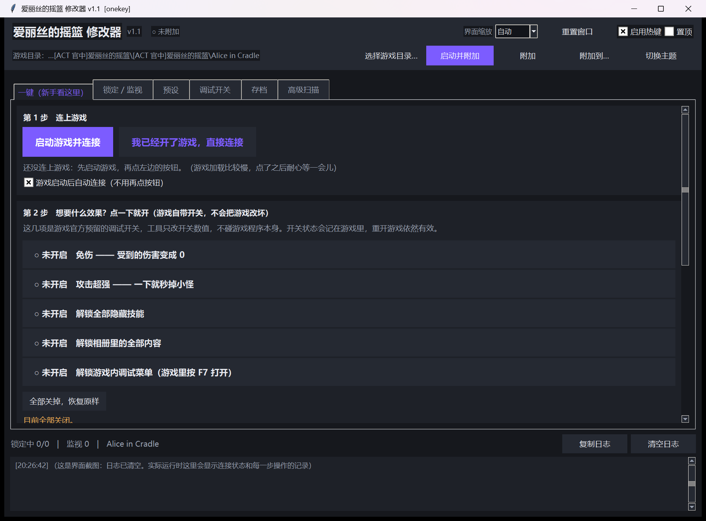
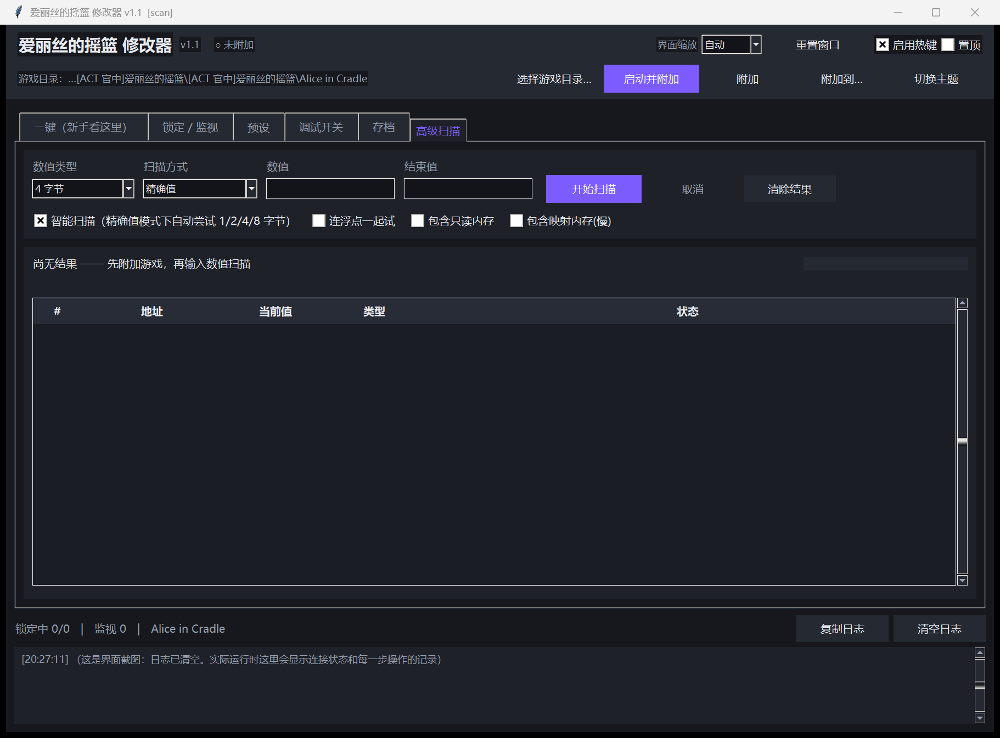

<div align="center">

# 爱丽丝的摇篮 修改器

**Alice in Cradle 的外部内存修改器 —— 不用懂原理，点几下就能用**

[](https://www.python.org/downloads/)
[](#系统要求)
[](#系统要求)
[](LICENSE)

**不注入 DLL　·　不 hook　·　不联网　·　不改游戏文件　·　所有改动可一键还原**

[下载使用](#下载与安装)　·　[快速开始](#三分钟上手)　·　[功能一览](#功能一览)　·　[常见问题](#常见问题)　·　[详细说明](使用说明.md)



</div>

---

## 这是什么

一个**纯 Python 写的外部内存修改器**，用于单机游戏 **《爱丽丝的摇篮 / Alice in Cradle》**
（Unity + Mono，64 位，支持 **v0.30f**，并兼容 v0.29a）。

和常见的修改器不同，它把「扫描内存 → 反复筛选 → 定位地址」这一整套专业流程，
**包装成了"填一次数字 + 点几下按钮"**：

> 你在游戏里看一眼金币是 137 → 填进工具 → 点「开始找」 → 回游戏花掉一些钱 →
> 点「我在游戏里把它【变小】了」 → 重复一次 → **✅ 找到了** → 「锁定它」，金币就再也花不掉了。

全程不需要知道什么是字节宽度、什么是筛选模式、地址长什么样。

## 亮点

| | 说明 |
|---|---|
| 🖱️ **傻瓜式** | 默认打开就是「一键」页，四步照做。按钮标题写的就是你刚做过的事，不会选错 |
| 🎮 **游戏自带开关直点** | 免伤 / 攻击超强 / 全技能 / 相册 / 解锁 F7 调试菜单 —— 官方预留的开关，点一下即生效 |
| 🛡️ **不碰游戏程序** | 不注入 DLL、不 hook、不联网，只在内存里改数值；唯一会写入的文件是游戏自带的 `_debug.txt`，且写入前自动备份 |
| ↩️ **一切可还原** | 「停用全部锁定」立刻恢复正常；调试开关可一键全关；`_debug.txt` 可还原到最初版本 |
| 💾 **自动备份存档** | 连接游戏时自动备份一次存档（含 sha256 校验），还原前还会再备份一次 |
| 🖥️ **支持高分屏** | 声明 DPI 感知按物理像素渲染，界面不发虚；顶栏「界面缩放」可整体调大调小 |
| 📦 **零依赖** | 全部用 Python 标准库，不用 pip 装任何东西，不需要管理员权限 |
| 🧪 **自带 10 套自测** | 从内存读写到界面排版都有回归测试，改代码不怕改坏 |

## 下载与安装

### 系统要求

- Windows 10 / 11（64 位）
- **Python 3.11 或更高**，安装时请勾选 **Add Python to PATH**
  - 已有 Python 就跳过；没有的话从 [python.org](https://www.python.org/downloads/) 装一个即可
  - 不需要 `pip install` 任何东西（本工具只用标准库）
- 游戏本体《爱丽丝的摇篮 / Alice in Cradle》（本工具不包含游戏）

### 方式一：下载压缩包（推荐普通玩家）

1. 到 **[Releases](https://github.com/soulalt/AliceInCradle-Trainer/releases/latest)** 页面，
   下载 `AliceInCradle-Trainer-v1.2.zip`（以后升级同理，文件名里带版本号）
2. 解压得到 `AIC修改器` 文件夹
3. 把整个 `AIC修改器` 文件夹**放进游戏根目录**（与 `AliceInCradle.exe` 同级）；
   **v0.30 的解压包是多层目录**，放进最外层也可以，工具会自己往下找：

```
Alice in Cradle/              ← 游戏根目录
├─ AliceInCradle.exe
├─ AliceInCradle_Data/
├─ MonoBleedingEdge/
└─ AIC修改器/                 ← 把文件夹放这里
   ├─ 启动修改器.bat           ← 双击这个
   └─ ...
```

4. 双击 **`启动修改器.bat`**

> 工具会**自己认出游戏目录**（按自身位置探测），所以放在哪、盘符怎么变都不用重新配置。

### 方式二：克隆仓库

```bat
git clone https://github.com/soulalt/AliceInCradle-Trainer.git
```

把克隆下来的文件夹重命名成 `AIC修改器`、放进游戏根目录即可（名字随意，启动脚本用的是自身路径）。

## 三分钟上手

> 打开修改器后**默认就停在「一键」页**，照 1→2→3 点即可。

| 步骤 | 做什么 |
|---|---|
| **① 连上游戏** | 游戏没开点「启动游戏并连接」（会等游戏加载完再连）；已经开着点「我已经开了游戏，直接连接」。也可以勾上「游戏启动后自动连接」，以后开游戏不用管 |
| **② 想要什么效果** | 免伤 / 攻击超强 / 全技能 / 相册 / 解锁 F7 菜单 —— 按钮上直接显示 `● 已开启`，再点一下就是 `○ 未开启`。⚠️ 改完要**重启游戏**才生效 |
| **③ 改金币 / 物品数量** | 填一次数字 → 「开始找」→ 去游戏里让数字变小 → 点「我在游戏里把它【变小】了」（或在游戏里按 **F8**）→ 重复 1~2 次 → 「锁定它」→ 想省事就再点「存为预设」 |
| **④ 改坏了想还原** | 同一页最下面：「停用全部锁定」「把游戏开关全部关掉」「还原 `_debug.txt` 到最初的样子」 |

### 「一键」页长什么样


### 想自己掌控每一步：高级扫描页



Cheat Engine 式的完整功能：精确值 / 大于 / 小于 / 介于 / 未知初始值 / 变化了 / 未变化 /
增加了 / 减少了，邻域浏览（一次找出挨着放的 HP / MP / EP），以及指针链地址。
原理与手动步骤见 [使用说明.md 第五节](使用说明.md)。

## 功能一览

| 页面 | 用途 |
|---|---|
| **一键（新手看这里）** | 连游戏 + 官方开关一键开 + 金币/物品自动查找 + 一键还原。**默认打开的就是这一页** |
| **锁定 / 监视** | 锁定项每 100ms 自动回写（游戏内数值被"按住"）；监视项只读实时刷新 |
| **预设** | 把定位好的地址存下来，一键套用；绑定功能槽位后可用全局热键开关 |
| **调试开关** | 完整读写游戏自带的 `_debug.txt`（比「一键」页多出所有冷门开关） |
| **存档** | 存档备份 / 还原 / 校验（sha256） |
| **高级扫描** | 手动定位任意数值，支持指针链 |

### 全局热键

| 热键 | 功能 |
|---|---|
| `F1` ~ `F5` | 免伤 / 无限魔力 / 一击必杀 / 金币 +99999 / 速度倍率循环（需先建立对应预设） |
| `F8` / `F9` | 「一键」页找数值时用：我刚把它**变小 / 变大**了（不用切窗口） |

热键可在 `config/trainer.json` 里改，也可以在顶栏直接关掉（关掉后游戏内按键立即恢复原样）。

## 安全与隐私

- ✅ **不注入、不 hook、不联网**：纯外部进程读写，没有任何网络请求，不含遥测
- ✅ **不改游戏程序**：不改 `exe`、不改 `Assembly-CSharp.dll`、不解包资源
- ⚠️ **唯一会写入的文件**：游戏自带的 `AliceInCradle_Data\StreamingAssets\_debug.txt`
  （官方预留的调试开关）。写入时只替换目标行的数字，**缩进 / 注释 / 行序 / 换行符逐字节保留**，
  首次修改前生成 `_debug.txt.orig.bak`，随时可一键还原
- ✅ **存档安全**：连接游戏时自动备份一次；还原存档前会再做一次安全备份；工具**不解析也不改写**
  `.aicsave` 二进制格式（那种做法容易废档）
- ⚠️ **写内存本身有极小概率让游戏崩溃** —— 这是所有内存修改器的固有风险。重要进度请先手动备份

## 常见问题

<details>
<summary><b>点「启动游戏并连接」后一直显示"正在加载"？</b></summary>

正常。本作加载要 30 秒左右，工具会**等游戏加载完再连**（刚启动的游戏进程地址空间几乎是空的，
那时附加进去会什么都扫不到）。超过 3 分钟仍未连上，点顶栏「附加」手动重试。
</details>

<details>
<summary><b>找不到游戏 / 提示"游戏目录：未找到"？</b></summary>

点顶栏「选择游戏目录…」，指到 `AliceInCradle.exe` 所在的文件夹即可。
正常情况下把 `AIC修改器` 放进游戏根目录就会自动认出来。
</details>

<details>
<summary><b>找金币时提示"一个都没剩下"？</b></summary>

说明你还没真的让金币变化，或者方向点反了。换个按钮重试，或点「重新开始」重来。
注意：如果你点按钮时游戏里的数值其实没动，工具筛掉的就是它。
</details>

<details>
<summary><b>找到了 2~3 个位置，哪个是真的？</b></summary>

**都是真的。** 游戏内部常把同一个数值存两份（显示用 + 逻辑用），它们永远同值同变，
工具会把这些拷贝**一起锁定**，不用你分辨。
</details>

<details>
<summary><b>重开游戏后锁定失效了？</b></summary>

正常：每次开游戏地址都会变。回「一键」页按第 3 步重新找一遍、再点一次「存为预设」即可。
如果想彻底免除重新定位，可以在「锁定 / 监视」页把地址改成 `模块名+偏移链` 形式
（如 `AliceInCradle.exe+0x10+0x28`）。
</details>

<details>
<summary><b>想改 HP / 魔力 / 移动速度？</b></summary>

HP / 魔力这类游戏里没有数字显示的，**直接用「一键」页第 2 步的「免伤」最省事**。
想精确改数值就走「高级扫描」页的手工向导（见 [使用说明.md](使用说明.md) 第五节）。
</details>

<details>
<summary><b>界面字太小 / 太大？</b></summary>

顶栏「界面缩放」选一个倍数（会问你是否自动重启修改器）。换显示器后排版乱了，点「重置窗口」。
</details>

<details>
<summary><b>会不会被杀毒软件报毒？</b></summary>

本工具含"读写其它进程内存"的行为，部分杀软会把它标成风险（内存修改器常见误报）。
代码全部开源、纯标准库，可自行审计。介意的话不要使用。
</details>

## 自己跑一遍自测

所有自测都把配置写进临时目录，**不会动你真实的 `config/trainer.json`，也不会碰存档**。

```bat
cd /d "AIC修改器"

:: 需要游戏的（会把工具放在游戏根目录下跑）
python tests\live_check.py                     :: 实机体检：启动游戏→自检→关闭
python tests\live_check.py --attach-only       :: 只附加正在运行的游戏
python tests\selftest_files.py                 :: 调试开关 / 存档
python tests\selftest_onekey.py                :: 「一键」页自动查找（用子进程冒充游戏）
python tests\smoketest_ui.py                   :: 界面冒烟（含"按钮有没有被挤出可视区"）

:: 不需要游戏的
python tests\selftest_winmem.py                :: 内存读写
python tests\selftest_scanner.py               :: 扫描引擎
python tests\selftest_scan_robust.py           :: 内存页读不到时的容错
python tests\selftest_crossproc.py             :: 跨进程端到端
python tests\selftest_control.py               :: 锁定 / 热键 / 预设
python tests\selftest_scaling.py               :: DPI 感知 / 界面缩放换算
python tests\selftest_restart.py               :: 改缩放后的自动重启
```

游戏装在其他位置时，用环境变量指定：

```bat
set AIC_GAME_DIR=D:\Games\Alice in Cradle
python tests\live_check.py
```

## 目录结构

```
AIC修改器/
├─ 启动修改器.bat              ← 双击这个（自动找 Python，找不到会提示）
├─ aic_trainer.pyw             ← 程序入口
├─ 使用说明.md                 ← 详细手册
├─ core/                       ← 核心逻辑（与界面解耦，可单独使用）
│   ├─ winmem.py              ── Win32 内存读写、模块/区域枚举、进程就绪判定
│   ├─ scanner.py             ── 扫描引擎（分块读取 + C 层字节匹配）
│   ├─ autofind.py            ── 「一键」页的自动查找（多宽度并行收敛）
│   ├─ freezer.py             ── 锁定/监视线程、地址解析（含指针链）
│   ├─ hotkeys.py             ── 全局热键
│   ├─ debug_flags.py         ── _debug.txt 精确读写
│   ├─ saves.py               ── 存档备份/还原/校验
│   ├─ presets.py             ── 预设
│   └─ paths.py               ── 路径探测与配置
├─ ui/                         ← tkinter 界面
│   ├─ scaling.py             ── 高 DPI 声明与界面缩放
│   ├─ main_window.py         ── 主窗口、顶栏、自动连接
│   ├─ tab_onekey.py          ── 「一键」页
│   └─ tab_*.py               ── 其余功能页
├─ tests/                      ← 自测脚本
├─ config/trainer.json         ← 配置（首次运行自动生成，已被 .gitignore 忽略）
├─ backup/                     ← 存档备份（自动生成）
└─ logs/                       ← 崩溃日志（正常情况为空）
```

## 已知限制

1. **游戏更新后可能失效** —— 版本一变，地址与类布局都会变。跑一次 `tests\live_check.py` 就知道工具本身是否还兼容。
2. **直接地址不抗重启** —— 每次开游戏地址都会变。用指针链形式（`模块名+偏移…`）才能跨重启复用。
3. **「一键」页找数值需要你配合一次** —— 工具没法预先知道地址，所以必须"填一次数字 + 让数值变化后点一下按钮"。
   这是所有内存修改器的固有代价，但只需做一次，之后可以存成预设一键套用。
4. **F1~F5 / F8 / F9 会抢占游戏按键** —— 影响操作就在顶栏取消「启用热键」，或改 `config/trainer.json` 里的绑定。
5. 仅面向**单机离线**使用。请不要用于任何联网或竞技场景。

## 免责声明

- 本工具仅供**个人学习与单机离线游戏**使用，请自行承担使用风险。
- 本仓库**不包含**游戏本体、游戏资源或任何破解内容，使用时需要你自行拥有正版游戏。
- 与游戏开发商、发行商无任何关联，也未获得其授权或认可。
- 因使用本工具造成的存档损坏、游戏异常或其它损失，作者不承担责任。**重要进度请先手动备份**。
- 如果你是版权方并认为本项目不妥，请提 Issue 联系，会及时处理。

## 更新日志

各版本改动见 [使用说明.md 的更新日志](使用说明.md)。

## License

[MIT](LICENSE)
